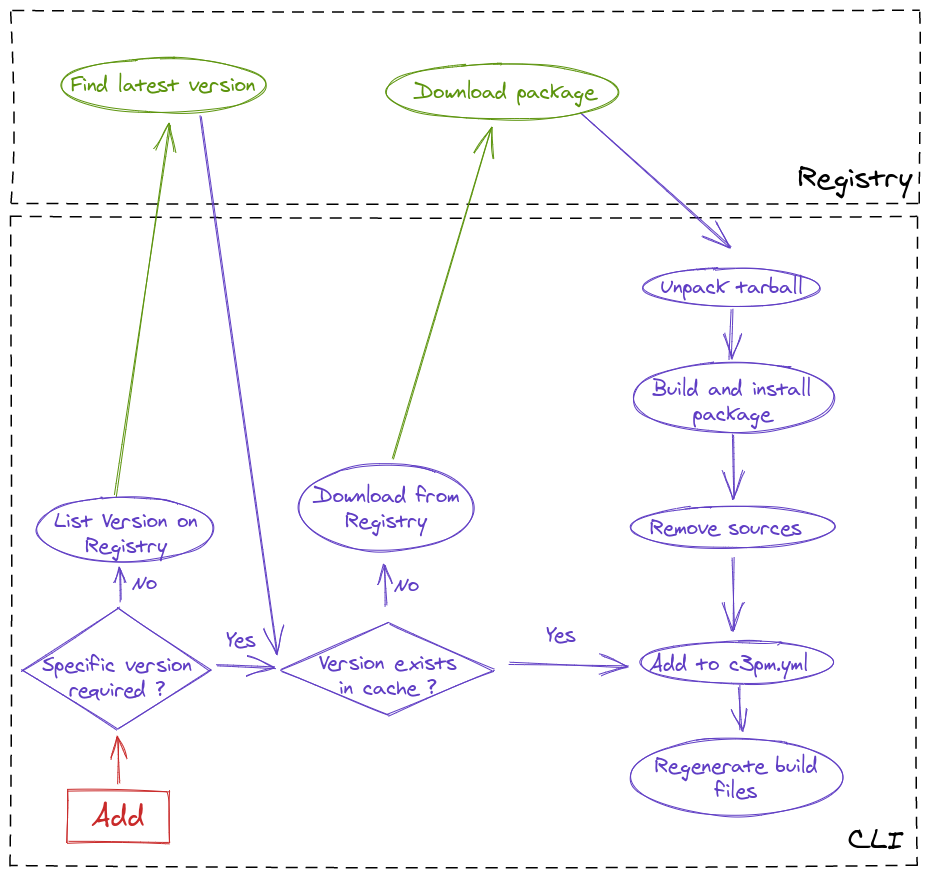
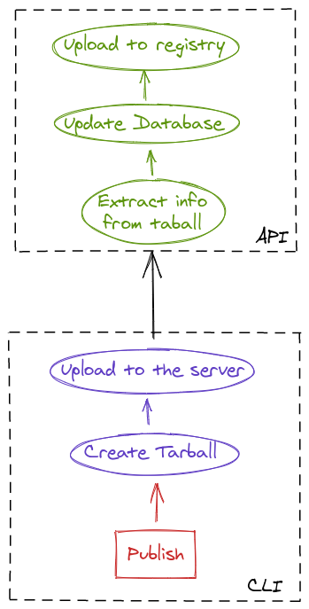

# Specs

* Owner: @Oursin
* Stakeholders: @gabrielcolson
* State
    * Spec: In Progress
    * Implementation: In Progress

This specification documents the dependency handling process of the c3pm CLI.

----

<!-- START doctoc generated TOC please keep comment here to allow auto update -->
<!-- DON'T EDIT THIS SECTION, INSTEAD RE-RUN doctoc TO UPDATE -->
**Table of Contents**

- [General presentation](#general-presentation)
    - [Add](#add)
    - [Publish](#publish)
  - [Publication process](#publication-process)
    - [Ignored files](#ignored-files)
    - [Extracted files](#extracted-files)
  - [Dependency addition process](#dependency-addition-process)

<!-- END doctoc generated TOC please keep comment here to allow auto update -->

# General presentation

Workflow schemas:

### Add

### Publish

## Publication process

1. The user runs the `publish` command
2. The CLI creates a `tar(1)` archive file containing most of the repository (see [exceptions](#ignored-files))
3. The CLI uploads the tarball to the server
4. The server extracts any needed files from the tarball (see [extracted files](#extracted-files))
5. The server creates a new entry in the database, storing the new version metadata, and updates the `latest`
value to the new version.
6. The server uploads the package to the storage bucket.

### Ignored files

There are a few files that are ignored by default:
* Any folder named `.git`
* The root `.c3pm` directory
* All files ignored by `.gitignore` files.

Furthermore, it is possible to add a `.c3pmignore` file to add c3pm-specific files to ignore, as well as
specifying them using the `--ignore` option of the `publish` command.

### Extracted files

Those are the files that the server will extract from the package, to use for metadata purposes.

* The `c3pm.yml` file.
* The `README.md`.

## Dependency addition process

1. The user runs the `add` command.
2. If no specific version was required by the user, find the latest version by listing them on the registry.
3. Check if the version exists in the application cache.
   1. If it exists, go to 6.
4. Download directly from the registry and unpack the package tarball in a temporary directory such as `/tmp` on Linux.
5. Build and install the package, following the [build](../cmake_generation/README.md) and [install](../c3pm_directory/README.md) specifications.
6. Add the package to the dependencies array in the [c3pm.yml](../config_file/README.md).
7. Regenerate the [build](../cmake_generation/README.md) files for the project.

